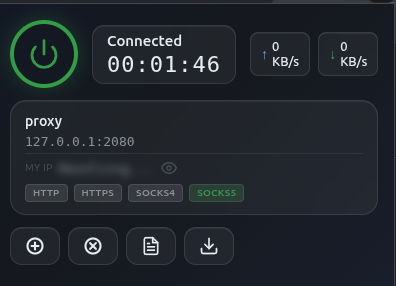

# RoxyProxy

Modern Proxy Manager for Chromium-based browsers – Easy & Fast

## Features

- **One-click connect** — glass power button toggles proxy on/off
- **Proxy profiles** — create, edit, delete multiple profiles (HTTP/HTTPS/SOCKS4/SOCKS5)
- **Live speed** — real-time upload/download speed in KB/s
- **Connection timer** — shows how long the proxy has been active
- **Bypass list** — add current tab URL or wildcard to bypass the proxy
- **Request logs** — view requests with method, type, URL, size — click to copy
- **Public IP** — displays your egress IP as seen through the proxy
- **GitHub Gist backup** — backup/restore profiles and bypass list to a private gist
- **Auto-backup** — optional automatic backup every 5 minutes while connected

## Installation

### Manual install (Developer mode)

1. Download or clone this repository
2. Open Chrome and go to `chrome://extensions`
3. Enable **Developer mode** (top-right toggle)
4. Click **Load unpacked**
5. Select the `RoxyProxy` folder

The extension icon will appear in your toolbar.

## Usage

### Quick start

1. Click the RoxyProxy icon in your Chrome toolbar
2. Click the profile card or the **+** button to add a proxy profile
3. Enter a **Name**, **IP/host**, **Port**, and select the **Protocol**
4. Click **Save**
5. Click the power button (circle) to connect — it turns green when active

### Action buttons

| Icon | Action |
|------|--------|
| ➕ | Add current tab's URL to bypass list |
| ⚡ | Add wildcard domain of current tab to bypass list |
| 📋 | Open request log panel |
| 💾 | Open backup settings panel |

### Backup

1. Create a GitHub [personal access token](https://github.com/settings/tokens) with `gist` scope
2. Create an empty [Gist](https://gist.github.com) and copy its ID (the hash from the URL)
3. Enter both in the backup panel and click **Save**
4. Use **Backup Now** / **Restore** to sync your data

## Permissions

| Permission | Reason |
|---|---|
| `proxy` | Configure Chrome's proxy settings |
| `storage` | Save profiles, logs, and settings locally |
| `webRequest` | Monitor network requests for logs and data usage |
| `tabs` / `activeTab` | Get the current tab's URL for the bypass list |
| `<all_urls>` | Apply proxy to all URLs |

## Building from source

No build step required. This is a vanilla JS extension with no dependencies. Just clone and load as an unpacked extension.

## License

MIT
